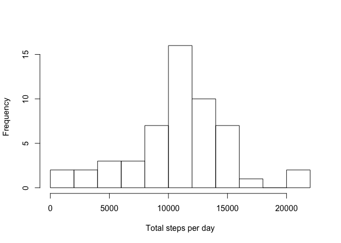
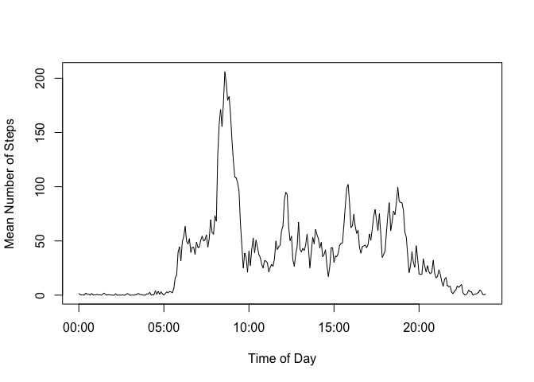
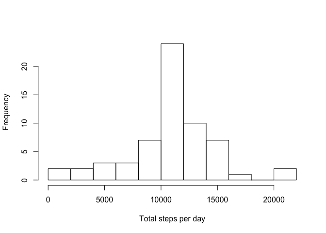
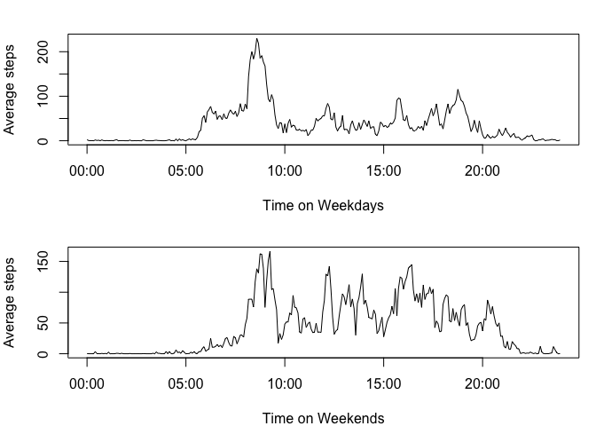

# Reproducible Research: Peer Assessment 1
By Luke Wolcott

This file describes a data analysis of step counting data.  An anonymous subject walked around with a tracker during October and November of 2012.  The tracker recorded the number of steps in each 5 minute interval during the day.  How many steps were taken each day, on average? How did the steps change throughout the day?  How does weekend and weekday activity compare?  We will try to answer these questions.


## Loading and preprocessing the data

We assume that the file "activity.csv" is in the working directory.

Each hour has twelve 5-minute intervals, so there are 24 x 12 = 288 entries per day.  There are 61 days of recorded data, giving 61 x 288=17568 entries total.  

The first column is the number of steps, the second is the date, and the third is the interval (given as an integer, so 835 means the interval starting at 8:35am).  We can load the data frame and add a column that treats the intervals as times, using the following code.


```r
d <- read.csv("activity.csv", stringsAsFactors = FALSE)
int_as_time <- formatC(d$interval, width=4, flag="0")
int_as_time <- strptime(int_as_time, "%H%M")
d <- cbind(d, int_as_time)
```


## What is mean total number of steps taken per day?

We are told to ignore NA values for this question, so we create a subsetted data frame to work with.


```r
e <- subset(d, steps != "NA")
```

The following code will add up the steps taken over each day, and put them into a vector tsd that has length 61 (because there are 61 days).


```r
tsd <- tapply(e$steps, e$date, sum)
```

And then we can make a histogram of the total number of steps taken each day.


```r
hist(tsd, breaks=10, main="", xlab="Total steps per day")
```

 

The mean and median can be read from a summary.  Seems like a lot of walking!

```r
summary(tsd)
```

```
##    Min. 1st Qu.  Median    Mean 3rd Qu.    Max. 
##      41    8841   10760   10770   13290   21190
```

## What is the average daily activity pattern?

We are curious about how stepping activity changes throughout the day, on average.  For this we will stick with the data frame with NAs removed.  The following code looks at each interval and averages the steps taken over the 61 days in that interval.  It returns a vector of length 288 (since there are 288 intervals each day).


```r
ada <- tapply(e$steps, e$interval, mean)
```

We can plot this as a time-series, treating the intervals as actual times.

```r
plot(unique(e$int_as_time), ada, type='l', xlab="Time of Day",ylab="Mean Number of Steps")
```

 

And here we find the interval in which this step average attains its maximum: 8:35 - 8:40am.

```r
ada[ada == max(ada)]
```

```
##      835 
## 206.1698
```


## Imputing missing values

Next we'd like to return to the original data frame and deal with the missing values.  The number of rows with NAs in the step column is 2304.

```r
sum(is.na(d$steps))
```

```
## [1] 2304
```

But there are no other NAs in the data frame.  For example:

```r
sum(is.na(d$date))
```

```
## [1] 0
```

We can look at the rows that have NAs, by subsetting the data frame, and find that there are eight days with NAs.

```r
      f <- subset(d, is.na(d$steps) == TRUE)
      unique(f$date)
```

```
## [1] "2012-10-01" "2012-10-08" "2012-11-01" "2012-11-04" "2012-11-09"
## [6] "2012-11-10" "2012-11-14" "2012-11-30"
```
      
Similar hunting shows that each of the 288 intervals has NAs, and in fact since 8 x 288 = 2304, we simply have eight solid days without step data.  To fill in these unknowns, it makes sense to use the interval averages computed earlier in the vector ada.  We will do this in a data frame called g.


```r
g <- d
g$steps <- as.numeric(g$steps)
ints <- unique(g$interval)
for (i in 1:nrow(g))
      if (is.na(g[i,1]))
            g[i,1] <- ada[[which(ints == g[i,3])]]
```

To see how this changes our analysis, let's look at the histogram and summary of the total steps taken, and compare.


```r
tsd_g <- tapply(g$steps, g$date, sum)
hist(tsd_g, breaks=10, main="", xlab="Total steps per day")
```

 

```r
summary(tsd_g)
```

```
##    Min. 1st Qu.  Median    Mean 3rd Qu.    Max. 
##      41    9819   10770   10770   12810   21190
```

The mean is the same and the median is barely changed.  We notice that the tallest bar of the histogram has grown but the rest of the histogram looks the same.  This makes sense since we are adding to the number of steps taken but drawing from averaged data to do this.

      
## Are there differences in activity patterns between weekdays and weekends?

Now, using this filled-in data frame, we'll look at the difference between weekday and weekend activity.  We add a column to our data frame that keeps track of if the day is a weekday or weekend, and then plot the time-series of average steps per interval.

```r
day_type <- character(nrow(g))
for (i in 1:nrow(g))
{
      x <- weekdays(as.Date(g[i,2]))
      if (x == "Sunday" | x == "Saturday")
            day_type[i] <- "weekend"
      else
            day_type[i] <- "weekday"
}
g <- cbind(g, as.factor(day_type))
names(g)[5] <- "day_type"

wkdys <- subset(g, day_type == "weekday")
wknds <- subset(g, day_type == "weekend")

ada_wkdys <- tapply(wkdys$steps, wkdys$interval, mean)
ada_wknds <- tapply(wknds$steps, wknds$interval, mean)

par(mfrow=c(2,1), mar = c(4, 4, 2, 1))
plot(unique(wkdys$int_as_time), ada_wkdys, type='l', xlab="Time on Weekdays", ylab="Average steps")
plot(unique(wknds$int_as_time), ada_wknds, type='l', xlab="Time on Weekends", ylab="Average steps")
```

 

It looks like the weekend activity is more spread out throughout the day, and our anonymous subject wakes up later on the weekends and stays up a little later.  He or she doesn't seem to have much of a Saturday night dancing habit, though.
